# FormCast

**A .NET GUI framework for TCC batch scripts.**

FormCast is a .NET plugin for [Take Command Console (TCC)](https://jpsoft.com/)
v36+ that turns BTM batch scripts into full Windows applications. Build
native GUI forms, handle events, manage layouts, and ship script-driven
tools that run like real desktop apps -- all from TCC.

Think of FormCast as a UI layer for TCC scripts.

## Why

TCC scripts are powerful, but historically limited to console interaction.
FormCast extends TCC with a structured UI layer so you can:

* add a structured UI layer on top of existing TCC workflows
* build interactive tools with validated input instead of manual prompts
* create script-driven utilities that behave like real desktop applications
* provide users with clear, guided interfaces instead of command syntax
* visualize progress, status, and results in real time
* package and run scripts in standalone app mode with no visible console

## Example

A minimal form that captures input and exits:

```
call formcast-check.btm load

set h=%@formopen[form,hello,0,0,280,160]

set RC=%@formadd[%h,lbl1,label,20,18,100,20,Name:]
set RC=%@formadd[%h,name,edit,110,16,140,22,]
set RC=%@formadd[%h,ok,button,100,60,80,28,OK]

set RC=%@formset[%h,.,acceptbutton,ok]
set RC=%@formshow[%h,modal]

set name=%@formget[%h,name,text]
set RC=%@formclose[%h]

plugin /u FormCast

echo Hello, %name
```

## Screenshots

Every image below was generated headlessly by FormCast itself via
`@FORMSAVEIMAGE` and `@FORMSAVECOMPOSITE`. The capture script lives at
[`examples/screenshots/capture-readme-images.btm`](examples/screenshots/capture-readme-images.btm)
and runs in unattended mode -- no window flashes in front of a user
during the build.

| | |
|---|---|
| 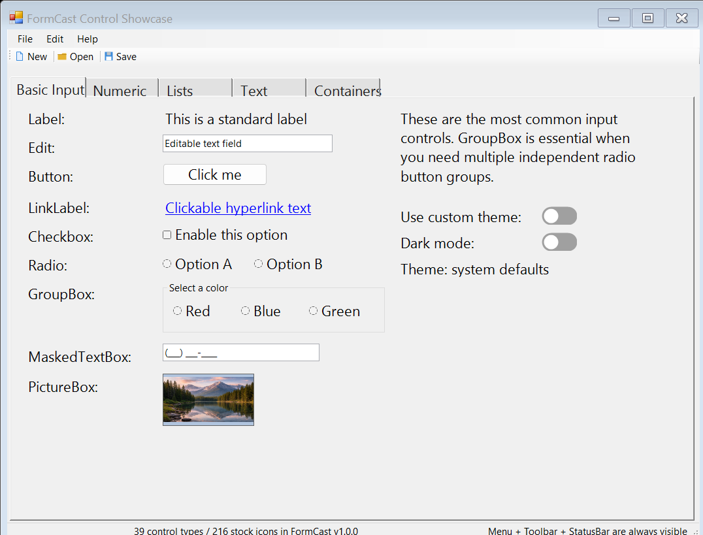 | 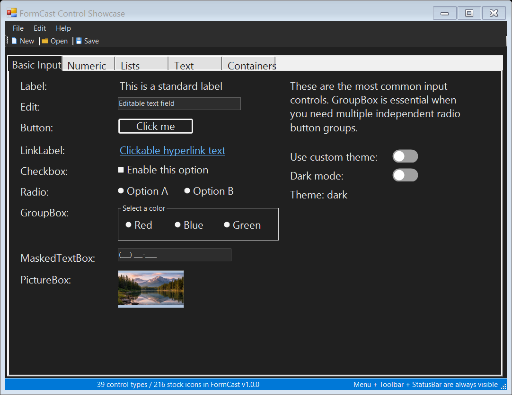 |
| Control showcase -- light theme ([`00-everything.btm`](examples/basics/00-everything.btm)) | Same form with dark theme |
| 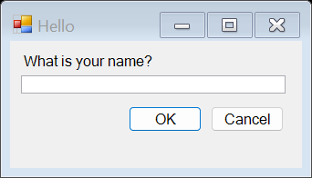 | 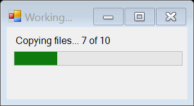 |
| Hello world dialog ([`01-hello.btm`](examples/basics/01-hello.btm)) | Progress bar ([`03-progress.btm`](examples/basics/03-progress.btm)) |
| 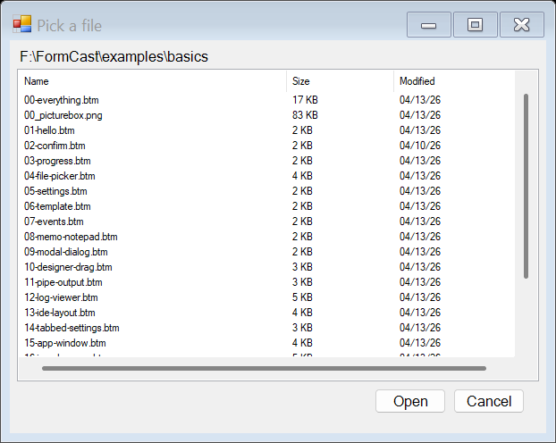 | 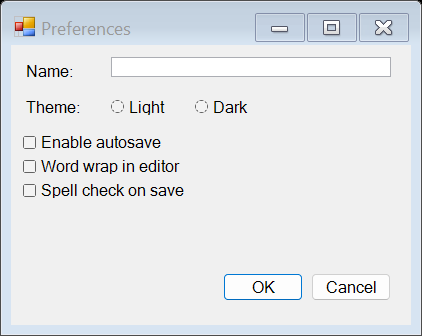 |
| Navigable file picker ([`04-file-picker.btm`](examples/basics/04-file-picker.btm)) | Settings form ([`05-settings.btm`](examples/basics/05-settings.btm)) |
| 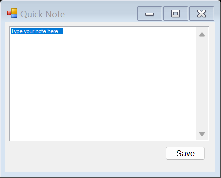 | 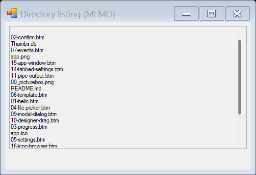 |
| Multiline MEMO ([`08-memo-notepad.btm`](examples/basics/08-memo-notepad.btm)) | `dir /b \| FORMPIPE` into a MEMO ([`11-pipe-output.btm`](examples/basics/11-pipe-output.btm)) |
| 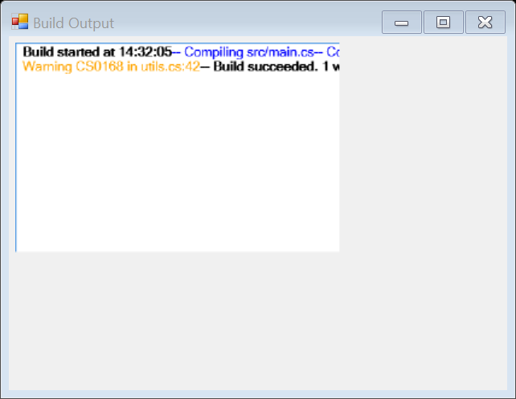 | 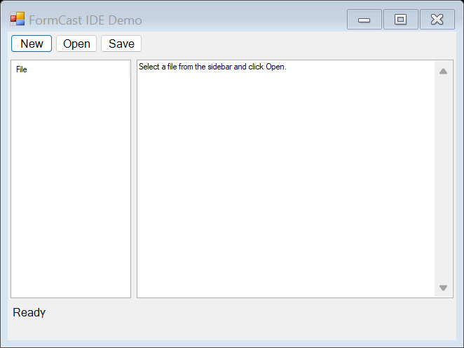 |
| RICHMEMO log viewer ([`12-log-viewer.btm`](examples/basics/12-log-viewer.btm)) | IDE layout ([`13-ide-layout.btm`](examples/basics/13-ide-layout.btm)) |
| 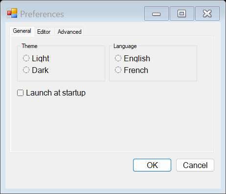 | 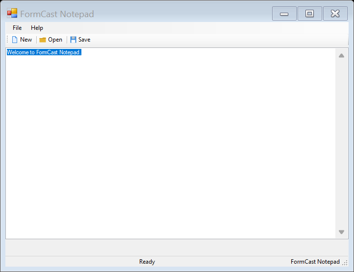 |
| Tabs + GroupBox + ComboBox ([`14-tabbed-settings.btm`](examples/basics/14-tabbed-settings.btm)) | Full app: menu + toolbar + editor + status bar ([`15-app-window.btm`](examples/basics/15-app-window.btm)) |
| 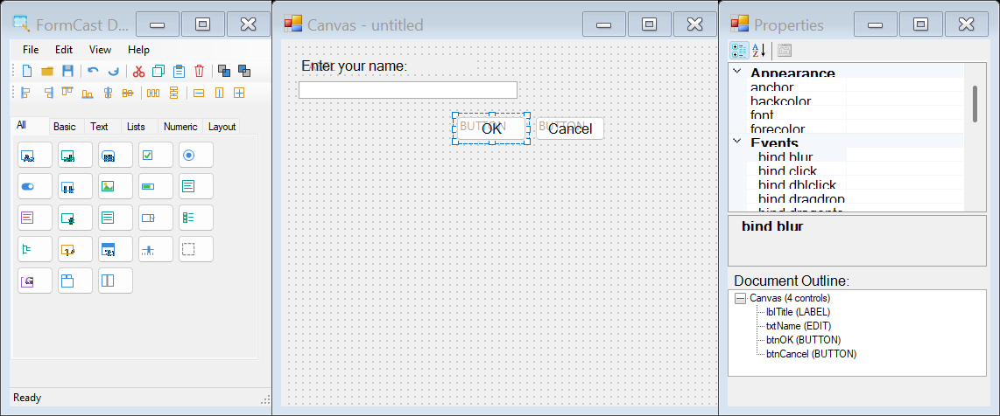 | 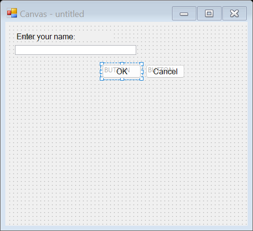 |
| Visual designer: Toolbox + Canvas + Properties via `@FORMSAVECOMPOSITE` ([`formcast-visual-designer.btm`](examples/designer/formcast-visual-designer.btm)) | Canvas with resize handles and snap-to-grid |

## What's in v1

### Core UI

* **39 control types + 6 common dialogs**: every WinForms control
 you need for app-like windows, including TOGGLE (on/off switch),
 MENUSTRIP, TOOLBAR, STATUSBAR, CONTEXTMENU, SEPARATOR,
 TABCONTROL, DATAGRID, TREEVIEW, SPLITCONTAINER, FLOWPANEL,
 TABLEPANEL, WEBBROWSER, and more
* **Four layout managers**: absolute, flow, grid, dock
* **Nested PANELs** with their own layout
* **216 stock icons** across 16 categories, applied via `stockicon`
 prop; `FORMICONS` command for enumeration

### Interaction

* **`FORMEVENTS` polling pattern** (recommended) for event-driven
 scripts via `do ev in /p formevents`
* **`@FORMBIND`-style declarative event binding** with click, change,
 focus, blur, dblclick, keypress, and close events
* **`on condition`-driven polling** via the `events_pending` bit
* **Modal `@FORMSHOW[h, modal]`** with optional WinForms.Timer
 auto-dismiss
* **Keyboard shortcuts**: `acceptbutton`/`cancelbutton` wire
 Enter/Escape to named buttons
* **Live property updates**: `text`, `value`, `min`, `max`,
 `checked`, `position`, `size`, `splitterdistance` update realized
 controls immediately

### Data & Integration

* **`FORMPIPE` streaming command** to pipe command output into a
 MEMO or RICHMEMO control (`dir /b | FORMPIPE %h memo`)
* **JSONC templates** with `${var}` substitution at load time
* **Appearance system**: `backcolor`, `forecolor`, `font` props on
 any control; `theme` (system/dark/light) with live switching and
 DWM dark title bar; `anchor` for resize behavior

### Application Features

* **Standalone app mode**: `myapp.btm /app` hides the TCC console
 via `@FORMCONSOLE[hide]` -- the user sees only the FormCast
 window with a custom taskbar icon and title. Desktop shortcut
 support with zero-flash launch via `start /inv`

### Advanced

* **Three-window visual designer** with Toolbox, Canvas (8-point
 resize handles, snap-to-grid, type labels), and Properties
 (PropertyGrid with live editing + Document Outline).
 Multi-select with Ctrl+Click for align, distribute, and size
 operations. Undo/redo, cut/copy/paste, context menus, and
 keyboard shortcuts.
 See `examples/designer/formcast-visual-designer.btm`
* **`FormCast.Host.exe`** scaffolding for cross-process global handles
 (the `IRemoteFormRegistry` decorator that uses it ships in v1.x)
* **Forced shutdown contract**: `plugin /u FormCast` cleans up every
 realized window before returning, so a misbehaving form can never
 outlive the plugin

## Standalone App Mode

Run a BTM as a full desktop application with no visible console:

```
myapp.btm /app
```

The TCC console is hidden. The user sees only the FormCast window, with
a custom taskbar icon and title. See **Install** below for the desktop
shortcut recipe that launches `/app` mode with zero flash.

## Quickstart

See **[docs/Quickstart.md](docs/Quickstart.md)**. Then:

| Topic | Read |
|---|---|
| Common questions by category | [FAQ](docs/FAQ.md) |
| Every `@FORM*` function and command | [Function Reference](docs/FunctionReference.md) |
| Step-by-step examples | [Tutorial](docs/Tutorial.md) |
| JSONC template format | [Template Reference](docs/TemplateReference.md) |
| Visual designer | [Designer Guide](docs/DesignerGuide.md) |
| How the plugin is wired | [Architecture](docs/Architecture.md) |
| Glossary of every term | [Glossary](docs/Glossary.md) |

## Requirements

To build:

* **.NET Framework 4.8** runtime
* **.NET SDK** (or Visual Studio 2022+) with the .NET Framework 4.8
 targeting pack

To run:

* **Take Command / TCC v36 or later**
* **Windows 10 or later, x64.** ARM64 works via x64 emulation.

## Build

From the repo root:

```cmd
dotnet build FormCast.sln -c Release
```

Output:

* `src\FormCast\bin\Release\net48\FormCast.dll` -- the plugin
* `src\FormCast.Host\bin\Release\net48\FormCast.Host.exe` -- the
 cross-process daemon (optional, used only by `Global\` forms)

## Install

1. Download the latest FormCast release zip from the releases page and extract it.
2. Copy the entire `bin/` directory to a permanent location (e.g.
 `C:\FormCast\bin\`). All dependency DLLs must stay alongside
 `FormCast.dll`.
3. Set the `FORMCAST_DLL` environment variable:
 ```
 set FORMCAST_DLL=C:\FormCast\bin\FormCast.dll
 ```
4. Load the plugin:
 ```
 plugin /l %FORMCAST_DLL
 ```

`@FORMVERSION` returns the loaded version. To unload:

```
plugin /u FormCast
```

**Desktop shortcut** (zero-flash launch for `/app` mode):

| Field | Value |
|---|---|
| Target | `"C:\path\to\tcc.exe" /c start /inv /pgm "C:\path\to\tcc.exe" /c "C:\path\to\myapp.btm" /app` |
| Start in | Directory containing the BTM |
| Run | Minimized |

The `FORMCAST_DLL` variable is used by the `/app` standalone
mode and the shared `formcast-check.btm` helper so BTM scripts can
find the plugin without hardcoded paths.

## License

[MIT](LICENSE) -- Copyright (c) 2026 Tim Butterfield

## Acknowledgements

* [JP Software](https://jpsoft.com/) for Take Command, TCC, and the
 v36 .NET plugin host (`TC-DotNetPluginHost64.dll`).
* The published `TakeCommand.Plugin` SDK header that documents the
 `ITCCPlugin` contract this plugin implements.
